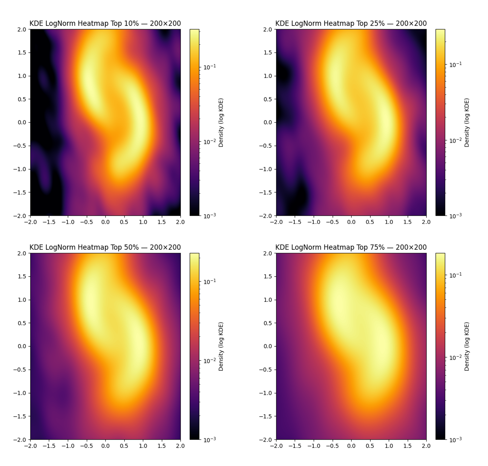

# Noise-Only Uncertainty Quantification for Prediction

A prediction-focused uncertainty quantification framework
based on truncated ensembles of generative models.

This project studies calibrated predictive uncertainty via
noise resampling and discrepancy-based model truncation.


## Calibration (IID Setting)


Empirical prediction coverage under an IID single-hidden-layer latent neural generator  
(200 independent Monte Carlo repetitions).

| Nominal | Noise-only | Conformal Prediction |
|----------|------------|----------------------|
| 0.990 | 0.989 ± 0.005 | 0.993 ± 0.006 |
| 0.985 | 0.984 ± 0.006 | 0.992 ± 0.006 |
| 0.970 | 0.969 ± 0.010 | 0.975 ± 0.011 |
| 0.950 | 0.949 ± 0.014 | 0.960 ± 0.015 |
| 0.900 | 0.900 ± 0.020 | 0.915 ± 0.021 |
| 0.850 | 0.850 ± 0.024 | 0.869 ± 0.026 |
| 0.800 | 0.800 ± 0.027 | 0.822 ± 0.030 |


### Key Observations

- Noise-only achieves near-exact nominal coverage across all confidence levels.
- Conformal Prediction exhibits slight over-coverage, consistent with its distribution-free guarantee.
- Under IID and approximately well-specified settings, the noise-only construction delivers calibrated predictive uncertainty without likelihood-based inference.

> This repository provides an implementation of the core noise-only uncertainty pipeline along with representative experimental results.  
> Additional large-scale studies and extended comparisons are beyond the scope of this demo repository.

## Predictive Uncertainty Visualization



*Representative predictive uncertainty patterns produced by the proposed
truncation-based noise resampling scheme.


---

## Key Idea

> **We construct prediction samples by resampling latent noise to analyze the
> plug-in predictive distribution induced by the flow model.**
>
> We study *prediction uncertainty* directly in the predictive (output) space,
> rather than parameter inference. After fitting a generative flow, fresh latent
> noise is resampled and propagated through the learned mapping to produce
> predictive outputs, forming a bootstrap-like pseudo predictive distribution.
>
> This truncation-based resampling scheme allows us to quantify uncertainty of
> future observations and supports downstream tasks such as predictive density
> visualization and prediction interval construction.

The pipeline:
1. Train multiple generative models on the same data
2. Rank models by Maximum Mean Discrepancy (MMD)
3. Truncate to the top-performing models
4. Generate predictive samples
5. Quantify uncertainty via variability in predictive space

This aligns with **modern statistics and machine learning practice** where
**prediction quality is the primary objective**.

---

## Pipeline Overview

1. Generate reference data (two-moons)
2. Train an ensemble of flow-based generators
3. Rank models by MMD loss
4. Truncate ensemble (top-k%)
5. Sample predictive outputs
6. Quantify predictive uncertainty
7. Visualize predictive distributions and uncertainty

---


## How to Run

```bash
python scripts/run_two_moons.py
